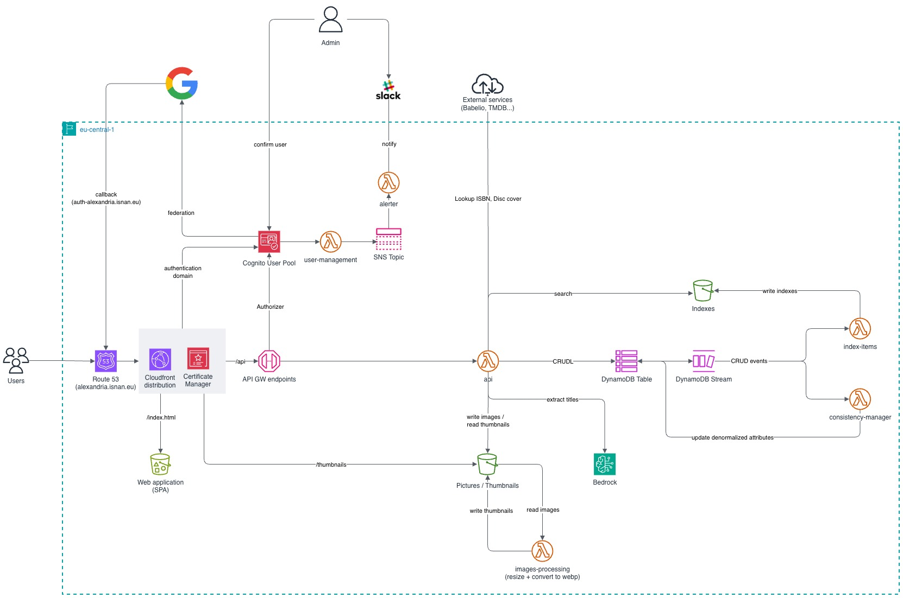

# Alexandria

Application which manages personal libraries.

## Design



## Web client

The app at `alexandria.isnan.eu` is `packages/web-client-v3` — React 19 + Vite 6 + Tailwind 4,
installed on its own with `yarn --cwd packages/web-client-v3` (no workspaces).

```
make frontend-preview   # build and serve against fixtures, no AWS needed
make frontend-serve     # dev server on :5173
make frontend-deploy    # build, sync to S3, invalidate CloudFront
```

`frontend-deploy` publishes to the live site. There is one bucket and one distribution, and the
sync runs with `--delete`, so it replaces whatever is there.

`packages/web-client-v2` is the previous client. It is kept for reference and nothing builds or
deploys it; run its scripts directly with `yarn --cwd packages/web-client-v2` if you need to.

### Checks

```
yarn --cwd packages/web-client-v3 test           # unit suite
yarn --cwd packages/web-client-v3 check:browser  # rules that only hold in a real browser
yarn --cwd packages/web-client-v3 lint
```

The two suites divide deliberately: `test` asserts rules are **declared**, `check:browser` asserts
they **survive the cascade** — computed colours, resolved fonts, real geometry, gestures that
actually fire. Several defects in this codebase were correct in the source and wrong on the page,
so the second suite is not optional.

